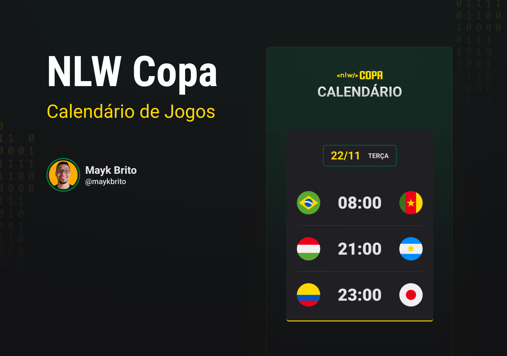

# PROJECT SUMMARY: Fullstack Project Qatar World CUP Schedule oct/2022

<h1 align="center">
  
</h1>

## About &lt;nlw/&gt; Copa

During <a href="https://lp.rocketseat.com.br/nlw?&">_**nlw COPA**_</a> week, students will have access to an efficient learning methodology, a community with thousands of devices, and a complete experience to accelerate their evolution. For the development of the application, the following stack was used: HTML, CSS and JS, for the Frontend and NodeJS and SQL, for the Backend.

> Status from Project: Under Construction

## Technologies

<a href="https://www.javascript.com/"> 
<a href="https://html.com/html5/"> 
<a href="https://www.w3schools.com/Css/"> 
<a href="https://git-scm.com/about"> 
<a href="https://nodejs.org/en/"> 

Thanks for visiting
